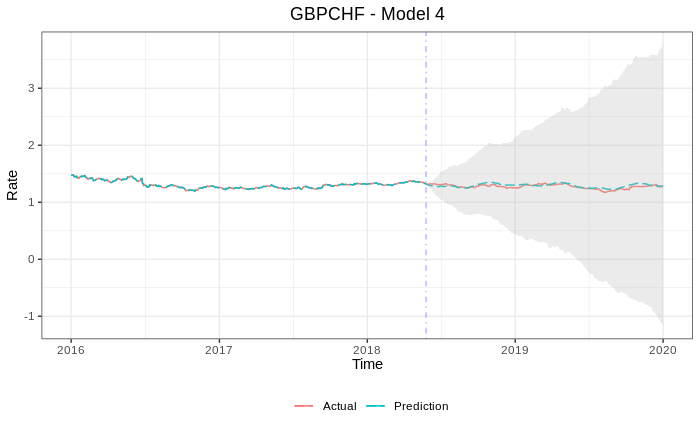
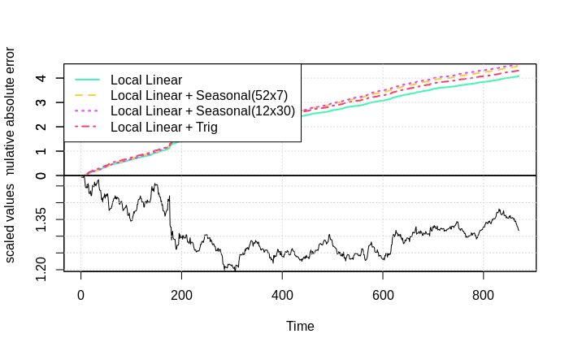
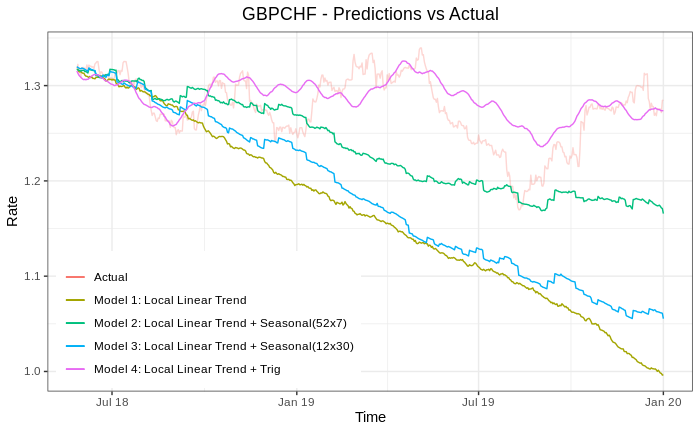
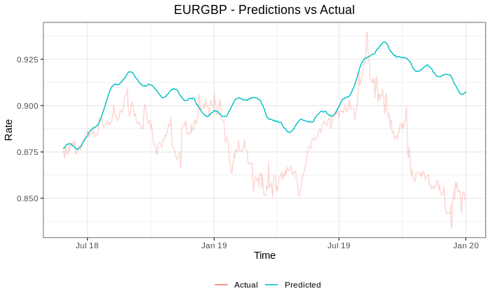

# Forex-MCMC
*Predicting forex rates using "Bayesian Structural Time-Series" and MCMC*

## Overviw
This notebook contains code for log-term prediction of daily forex currency pair rates. However, instructions are included in the notebook for using a dataset with smaller than 24hr candles.

1. The data is loaded, preprocessed, and split into training and testing automatically. 

2. A number of different models are defined (using the `bsts` library) to fit the training data and make predictions:

The performance of different models are plotted and compared with each other regarding their fit (in training):

and accuracy (in prediction):

  * The optimal model with the highest accuracy is used on another currency pair to examine its performance.

3. Finally, the performance of the Bayesian models are compared with that of popular time-series forecasting models such as *ARIMA*.

 * The Bayesian models outperformed the ARIMA model, yielding a prediction accuracy of `98.3%` as aposed to `75.7%`.
    
